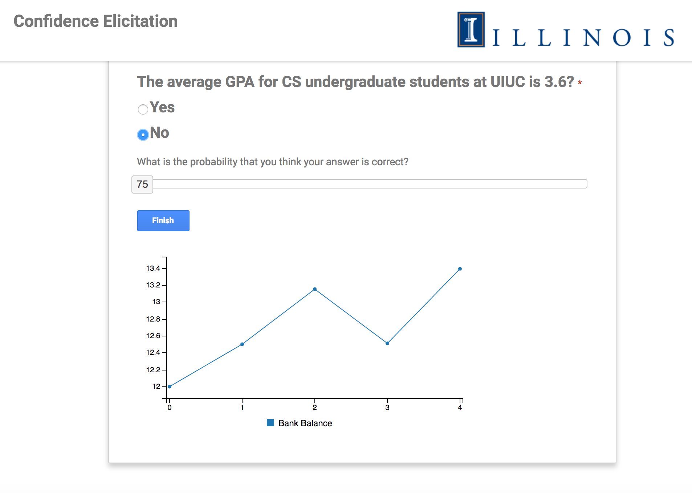

## Update log

<<<<<<< HEAD
### 02/26/2017
- Fit the handle and the plot

### 02/25/2017
- Used vanilla D3 to draw quadratic plot, handle, axis without ticks

### 02/14/17
- Made y axis 3 times larger than x axis
- Fixed the bug that x color bar can be beyond the range
- Forked into local github account

### 02/10/17
- Display quadradic function
- Display bars on axis
- Created cursor on the plot
=======
### 02/23/17
- Fixed experimenter questions.
- Changed instructions depending on groups.
- Added breaks after N questions.

### 02/14/17
- Fixed money calculation.
- Add group select page and instructions.
- Cleaned up code a little

### 02/06/17
- Added dynamic money bank and graph.
- Added identification page.
- Changed layout a bit.

### 02/03/17
- Finished the general framework (read questions, process, output answer).
- Added output functionality (write locally or write to server).
- Tweaked the slider to be more smooth and pass value accurately.
>>>>>>> d416e56dcede672200f991a6ff1094d41a152639

### 01/24/17
- Added general framework with jQuery and jQuery-UI.
- Added general slider.
- Create general JSON format for question as an example.

<<<<<<< HEAD
## To Do
- Convert csv to JSON
=======
## To Do (john):

### 02/23/17
- Make button on break page appears after M seconds.
- Incorporate parabolic sliders
- Clean up code

### 02/06/17
- Add capability to load everything into one CSV file.
- Add study instruction to first page or separate page.
- Make more responsive with bootstrap.

### 02/03/17
- Add the money bank functionality.
- Add front page to select which type study to give out.
- Fix the text value on the slider to properly reset with new question.

### 01/24/17
- Record slider value after submitting question.
- Reset slider value after question
>>>>>>> d416e56dcede672200f991a6ff1094d41a152639
